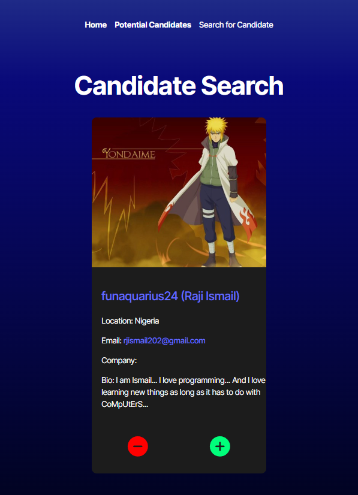
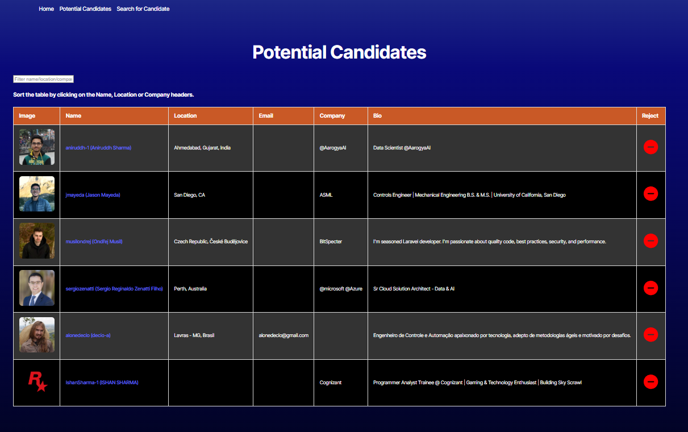

# Candidate Search App

## Description
This app searches for a list of potential candidates for an IT position on GitHub, and then displays the candidate's Github information for the user. The user can then add or remove candidates from a database. Once satisfied with the first review. The user can then see all the candidates that they marked as potential candidates in a large table, from there they can see the basic necessary information about the candidates, and remove them if necessary.

## Table Of Contents
1. [Installation](#installation)
2. [Usage](#usage)
3. [License](#license)
4. [Contribution Guidelines](#contribution)
5. [Tests](#tests)
6. [Questions](#questions)

## Installation
Download the program files, and in a terminal run "npm i" to install the necessary dependencies. After than run "npm run dev" to start the application.

## Usage
Open the page and you will first see a candidate information card. You can click on the "plus" symbol to save the candidate to the potential candidates pool, or click the "minus" symbol to move to the next candidate. See the the first image below for a preview of the interface.  

After you have enough candidates, you can then review candidates you've selected in the Potential Candidates page, and remove them from there if necessary. See the second image below for a preview of the interface.   

There is also a third page you can use to search Github from specific candidates if you know their Github username.

## License
Distributed under the MIT. Visit [MIT](https://opensource.org/licenses/MIT) for more information.

## Contribution Guidelines
None

## Tests
Visual Studio and Render.com

## Questions
Feel free to reach out to me if you have any questions, or if you'd like to find out what else I've worked on. My details are as follows:  
  Github: https://github.com/Liathor  
  Email: dyermisha@gmail.com  
